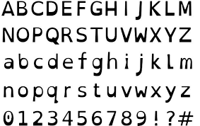

According to Oxford Advanced Learner's Dictionary:

<blockquote>
  

    Dyslexia is a slight disorder of the brain that causes difficulty in reading and spelling, for example, but does not affect intelligence.
  

</blockquote>

Dyslexia affects about 1 in 5 people worldwide. Its symptoms range in severity from mild to extreme. Since letters, numbers, punctuation, and other characters  are often transposed by Dyslexia, font choice is an important thing to consider.

## Background

When designing fonts, some typographers flip and rotate one character to form other characters. Letters b, p, d and q are usually created using this method. This is because it makes it easier to make the font. However, this practice can causes problems for people with Dyslexia. This is because some letters, numbers, punctuation, and other characters become indistinguishable. Hence, making it easy to confuse one for another. As a result, people with Dyslexia prefer fonts where all the characters are unique. 

## Introducing Dyslexia fonts

Dyslexia fonts are typefaces designed specially for people with Dyslexia. They are designed so that each character is unique and distinguishable. Dyslexia fonts also make each character unique by using thicker lines in some parts of the letters, as well as slanting them a bit. 

Some Dyslexia fonts include: 

- [Dyslexie](https://www.dyslexiefont.com/en/home/), 
- [Open Dyslexic](https://opendyslexic.org/), 
- [Lexie Readable](http://www.k-type.com/fonts/lexie-readable/), and
- [Read Regular](http://www.readregular.com/english/intro.html).

 
According to recent studies, it has been proven that Dyslexia fonts do **not** help people **read faster and make fewer mistakes**. In fact, most people with Dyslexia prefer Verdana and Helvetica to  other fonts. For  a  detailed  review of the case study, see  [Good Fonts for Dyslexia (opens PDF)](http://dyslexiahelp.umich.edu/sites/default/files/good_fonts_for_dyslexia_study.pdf)

## General font tips

The following are general font tips that improves the overall quality of a website:

- Font size should be at least 12-14pt or its equivalent. This is because people with cognitive disabilities, language and learning disabilities, and low vision  cannot perceive the text. 
- Larger line spacing improves readability. Proper line spacing makes the[ web content](https://en.wikipedia.org/wiki/Web_content) flow smoothly and ensures that the visually rendered text is presented in such a manner that is perceived without its layout interfering with its readability.
- Use a small number of fonts, ideally 1 or 2. This is because multiple fonts makes a website look unstructured and unprofessional.
- Use **bold** to add emphasis rather than *italics* or UPPERCASE. This is because decorated text can be difficult to read. Also, when words are written in all caps, they have a uniform rectangular shape meaning readers can't identify words by their shape. Consequently, this retards the speed of scanning and reading of readers.
- Animated texts must be used sparingly. This is because animations can be distracting espcially for a person with [AD/HD](https://www.cdc.gov/ncbddd/adhd/facts.html).

## Summary

Dyslexia is a [Phonological Processing disorder](https://www.nicklauschildrens.org/conditions/phonological-process-disorders). This means it is an issue with language processing, not vision. Hence using a specific font is not a treatment for Dyslexia. However, most people with Dyslexia prefer Verdana and Helvetica to other fonts.
